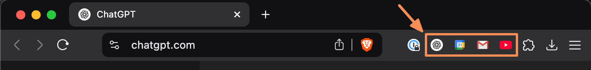

# `QuickLaunch` - A Chrome Extension Generator



Welcome to **QuickLaunch** – the alternative to a cluttered bookmarks toolbar.

Instead of having **an entire toolbar packed with bookmarks**, why not have a single, stylish extension that serves as a shortcut? Save screen real estate, keep things tidy, and enjoy quick access to your favorite websites!

## What Is It?

**QuickLaunch** is a Javascript-based tool that generates a custom Chrome extension for a single URL bookmark. This extension:
- Fetches a **high-resolution 64px favicon** (fetched automatically from Google's faviconV2 service).
- Lets you **click the toolbar button to open the URL you've configured**.
- Includes an **options page so you can update the URL later**, without re-creating the extension again.
- Resolves URLs (for example, handling Gmail redirects) to get the proper hostname and favicon.

## Why Use It?

Imagine opening Chrome and being able to click a single icon to jump directly to your favorite site without needing a bulky bookmarks bar. It's sleek, minimalistic, and it provides exactly what you need for a couple of shortcuts. Perfect for those who prefer a clean interface with all the functionality they want.

## How to Use

1. **Clone or Download the Repository**

   Clone this repository or simply download the `createExtension.ts` file.

2. **Run the Script with Bun**

   Make sure you have [Bun](https://bun.sh) installed, then run the following command in your terminal:

   ```bash
   bun i
   bun start "https://mail.google.com/?authuser=your.email@example.com#inbox"
   ```

   It's just a typescript file so you can run it with any other tool you like that automatically converts typescript.
